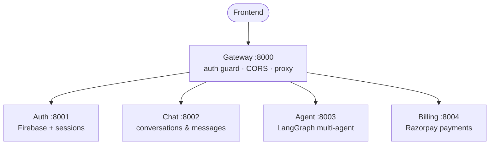

<div align="center">

# Gyaani AI — Backend

Node.js/Express microservices backend for Gyaani AI, a multi-agent AI assistant platform (chat, coding, PDF/PPT generation, image generation, web search) with Google auth and Razorpay billing.


</div>

---

## Table of Contents

- [Architecture](#architecture)
- [Services](#services)
- [Agents](#agents-servicesagent)
- [Prerequisites](#prerequisites)
- [Setup](#setup)
- [Running](#running)
- [Notes](#notes)

---

## Architecture

A gateway proxies all client requests to independent services, each with its own database/connection and `.env`.



## Services

| Service | Port | Responsibility | Data store |
|---|---|---|---|
| `gateway` | 8000 | Single entry point. Verifies session cookie (Redis) and proxies to the service behind each route, injecting `x-user-id`. | Redis (sessions) |
| `services/auth` | 8001 | Google sign-in (Firebase ID token verification), session issuing, plan/credit updates. | MongoDB, Redis |
| `services/chat` | 8002 | Conversations and messages CRUD. | MongoDB |
| `services/agent` | 8003 | The AI core — a LangGraph state machine routing to per-purpose agents (chat, coding, search, PDF, PPT, vision, PDF-RAG). | MongoDB, Redis, Qdrant (vector store) |
| `services/billing` | 8004 | Razorpay order creation/verification, credit top-ups. | MongoDB |

All services are plain Express apps (`type: module`, ESM) under Node.js and share the Redis client in `shared/redis/redis.js`.

## Agents (`services/agent`)

The agent service routes each message either to the agent the user explicitly picked, or auto-classifies it via an LLM router:

- **chat** — general conversation
- **coding** — generates a small HTML/CSS/JS (or React/Next/Vue) project, returned as an artifact
- **search** — web search via Tavily
- **pdf** — generates a PDF document
- **pdfRag** — answers questions about an uploaded PDF (chunked + embedded into Qdrant)
- **ppt** — generates a PPTX deck
- **vision** / **imageAnalyzer** — generates or analyzes images

Generated PDFs/PPTs/images are uploaded to S3 and served back as time-limited signed URLs.

---

## Prerequisites

- Node.js 18+
- A MongoDB connection (Atlas or local) — one database per service is recommended
- Redis (`docker-compose up -d` from this directory spins up Redis on `6379`, or run one locally)
- A Firebase project with Google sign-in enabled (Admin SDK service account for the backend, web API key for the frontend)
- API keys as needed: Groq, Google (Gemini), OpenRouter, Tavily, Qdrant, AWS S3, Razorpay

---

## Setup

Each service is independent — install and configure them one at a time.

**1. Install dependencies**

```bash
cd backend/gateway              && npm install
cd backend/services/auth        && npm install
cd backend/services/chat        && npm install
cd backend/services/agent       && npm install
cd backend/services/billing     && npm install
```

**2. Configure environment variables**

For each of the five folders above, copy `.env.example` to `.env` and fill in real values:

```bash
cp .env.example .env
```

**3. Firebase service account (auth only)**

`services/auth` additionally needs a Firebase Admin service account key saved as `services/auth/serviceAccountKey.json` (Firebase Console → Project Settings → Service Accounts → Generate new private key).

> **Never commit this file** — it's already gitignored.

**4. Start Redis**

```bash
cd backend && docker-compose up -d
```

---

## Running

Run each service in its own terminal (there's no single "start all" script yet):

```bash
cd backend/gateway            && npm run dev   # :8000
cd backend/services/auth      && npm run dev   # :8001
cd backend/services/chat      && npm run dev   # :8002
cd backend/services/agent     && npm run dev   # :8003
cd backend/services/billing   && npm run dev   # :8004
```

`npm run dev` uses `nodemon`; `npm start` runs the plain `node` process for production.

Sanity check once everything is up:

```bash
curl http://localhost:8000/   # {"message":"hello from gateway v5"}
```

---

## Notes

- The gateway is the only service the frontend should ever talk to (`VITE_SERVER_URL` in the frontend's `.env`); the other four ports are internal.
- Sessions are cookie-based (`session` cookie → Redis lookup), not JWT — `protect` middleware in the gateway reads it and forwards the resolved user as `x-user-id` to downstream services.
- Credits are deducted per agent call and refreshed on the frontend after each message and after billing events.
